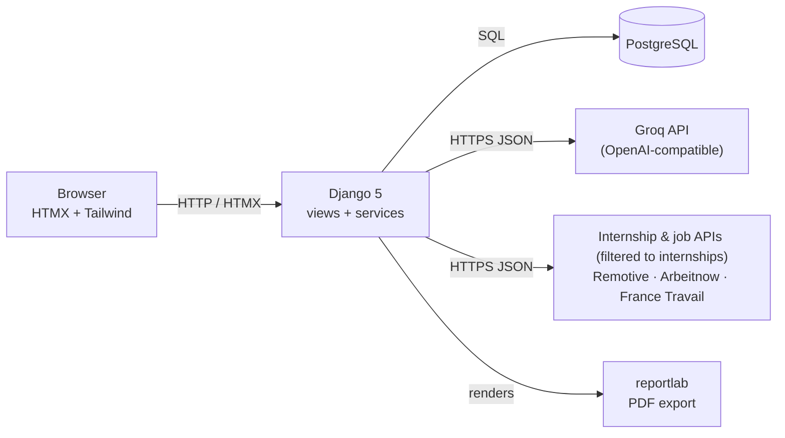

# JobPilot

**An AI copilot for internship search — built by an engineering student to land his own stage de fin d'études (and track alternance or other contracts along the way).**


<!-- TODO: replace with a real screenshot of the dashboard -->


<!-- TODO: replace with a real ~15s GIF walking through: upload CV → offer list → score radar → Kanban drag -->


**What to capture for the screenshot/GIF above** (see `docs/DEMO.md` for the full script):
- Dashboard: stat tiles + the 4 charts, in light and dark mode.
- Job list: score badges on cards, contract-type filter.
- Offer detail: compatibility radar, legitimacy badge, the Lettre/CV/Entretien tabs.
- Kanban board: dragging a card between columns.

## The problem

I'm a final-year computer engineering student in Morocco, searching for my end-of-studies
internship (*stage*), mostly in France. Job boards don't know I'm a student, so most matches waste
my time on senior roles I have no shot at, and internships are rarely even a filterable category.
I built JobPilot to parse my own CV, score real offers against my actual student profile instead
of generic keyword matching, and generate the paperwork (cover letter, tailored CV, interview
prep) without ever inventing a skill or experience I don't have — while still tracking alternance
and other contract types when they're relevant to the search.

## Features

- **CV analysis** — upload a PDF, get a structured profile (skills, experience, education) parsed by an LLM.
- **Internship-first job import & analysis** — pulls live offers from Remotive, Arbeitnow, and France Travail, filtered to internships by default (alternance and other contract types stay one click away), plus manual paste-and-extract for sites that forbid scraping; each offer gets a 5-axis compatibility score with a legitimacy check.
- **Application documents** — generates a cover letter, an ATS-friendly tailored CV, and STAR-format interview prep per offer, exportable to PDF.
- **Tracking & stats** — a drag-and-drop Kanban board for applications and a dashboard with real aggregate charts (missing skills, market demand, score distribution, applications over time).

## Stack

Django 5 · PostgreSQL 16 · HTMX + Tailwind (CDN) · Chart.js · SortableJS · Groq (OpenAI-compatible
LLM API) · pdfplumber · reportlab · gunicorn + WhiteNoise · Docker · GitHub Actions

## Technical decisions

**HTMX over React.** This is a single developer shipping one step at a time. Server-rendered
partials swapped over the wire meant no separate API layer, no client-side state management, and
every feature could be built and tested end-to-end in one pass. The trade-off (less client-side
interactivity) never mattered for a CRUD- and forms-heavy app like this.

**Groq instead of OpenAI.** Free/cheap high-throughput inference was the deciding factor for a
project run on a student budget. The LLM client (`apps/core/llm.py`) talks to any
OpenAI-compatible endpoint, so swapping providers is a one-line env var change, not a rewrite.

**Anti-hallucination filter on the tailored CV.** The prompt tells the model never to invent a
skill or experience, but prompts aren't guarantees. `apps/letters/services.py` cross-checks every
skill and experience title the AI returns against what's actually stored on the candidate's
profile in code, and silently drops anything that doesn't match — the instruction is enforced,
not just requested.

**Student-aware matching, not generic keyword scoring.** The matching prompt is told explicitly
that the candidate is a final-year student targeting an internship. For stage/alternance offers,
the experience axis is scored on academic projects and prior internships instead of penalizing
the lack of years in a company; for senior roles requiring years of professional experience, the
score reflects that gap honestly instead of pretending it isn't there. A separate field flags
administrative requirements mentioned in the offer (mandatory internship agreement, degree level,
nationality, work permit) to check before applying.

**Contract-type filtering is the central lens, not a checkbox.** JobPilot's whole premise is
isolating internships in a firehose of listings meant for everyone, so contract type
(stage / alternance / cdi / cdd / interim / freelance) is a first-class field on every offer,
defaults to "stage" across the job list, the imports, and the dashboard stats, and drives which
axis weighting the AI applies (see student-aware matching above). This matters because the source
APIs don't do that filtering for us — France Travail, notably, has no dedicated internship code at
all (see below), so without an explicit filter maintained at the JobPilot layer, internships would
simply drown in senior listings.

**No scraping of sites that forbid it.** LinkedIn, Indeed, and Rekrute don't allow automated
collection. JobPilot never scrapes them: it only pulls from public APIs (Remotive, Arbeitnow,
France Travail) and, when a pasted link is detected from one of those domains, tells the user
plainly to copy the text instead — the AI then extracts the structured fields from that pasted
text, same as any manually-added offer.

**What the France Travail API actually looks like, once you read the referentiels instead of
guessing.** There is no "stage" contract-type code in `/referentiel/typesContrats` or
`/referentiel/naturesContrats` at all — real internship postings are coded as `typeContrat=CDD`
with `natureContrat` set to the apprenticeship code (`E2`) and an `alternance=true` flag, often on
listings literally titled *"Stage de fin d'études / Alternance"*. The importer targets those
codes and treats an explicit "stage" mention in the title as taking priority over the alternance
flag, so genuine internships still surface as stages instead of being folded into "alternance".
Separately, the `motsCles` search parameter combines multiple comma-joined terms with **AND**
semantics, not OR — `motsCles=python,java` returns *fewer* results than `motsCles=python` alone.
Broadening the keyword list therefore means one API request per keyword, merged and deduplicated
by offer ID client-side, rather than a single combined query.

## Architecture



See `docs/ARCHITECTURE.md` for the per-app breakdown, the full offer-analysis request flow, and
the data model.

## Local setup

```bash
git clone https://github.com/yahyabaidar/jobpilot.git && cd jobpilot
cp .env.example .env   # fill in LLM_API_KEY at minimum — see below
docker compose up --build -d
docker compose exec web python manage.py migrate
docker compose exec web python manage.py createsuperuser
```

The app is then available at http://localhost:8000.

### Environment variables

| Variable | Required | Notes |
|---|---|---|
| `SECRET_KEY` | yes | any random string in dev |
| `DEBUG` | yes | `True` locally |
| `ALLOWED_HOSTS` | yes | `localhost,127.0.0.1` locally |
| `DATABASE_URL` | yes | set by `docker-compose.yml` for local dev |
| `LLM_BASE_URL` | yes | e.g. `https://api.groq.com/openai/v1` |
| `LLM_API_KEY` | yes | your Groq (or other OpenAI-compatible) key |
| `LLM_MODEL` | yes | a model your key can access — verify with `python manage.py check_llm` |
| `FRANCE_TRAVAIL_CLIENT_ID` | no | leave empty to disable this source cleanly |
| `FRANCE_TRAVAIL_CLIENT_SECRET` | no | same |

### Running tests

```bash
docker compose exec web pytest
docker compose exec web ruff check .
docker compose exec web ruff format --check .
```

Tests never call a real LLM or external job API — everything is mocked.

## Known limitations & v2 roadmap

- **Ephemeral media storage** on free-tier hosting: uploaded CVs don't survive a redeploy unless
  an external object store is wired in (see `docs/DEPLOIEMENT.md`).
- **No background task queue.** Imports and AI analyses run synchronously in the request/response
  cycle (or a request-per-step HTMX chain for batch operations) — fine at this scale, would need
  Celery/RQ for real concurrency.
- **France Travail has no dedicated internship code** (see above) — classification relies on a
  heuristic that is accurate but not guaranteed exhaustive.
- **No email notifications** (application reminders, weekly digest).

v2 ideas: Celery-backed async imports and batch analysis, S3-compatible media storage, more job
sources, a public read-only demo mode, richer interview-prep coaching (mock Q&A follow-ups).

## License

MIT — see [LICENSE](LICENSE).

## Author

Yahya Baidar
