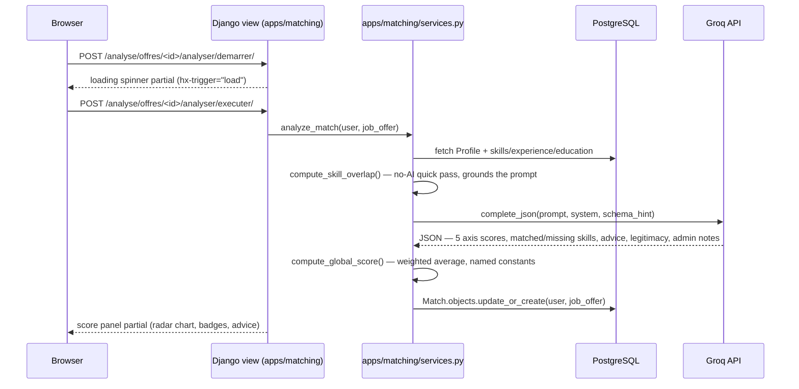
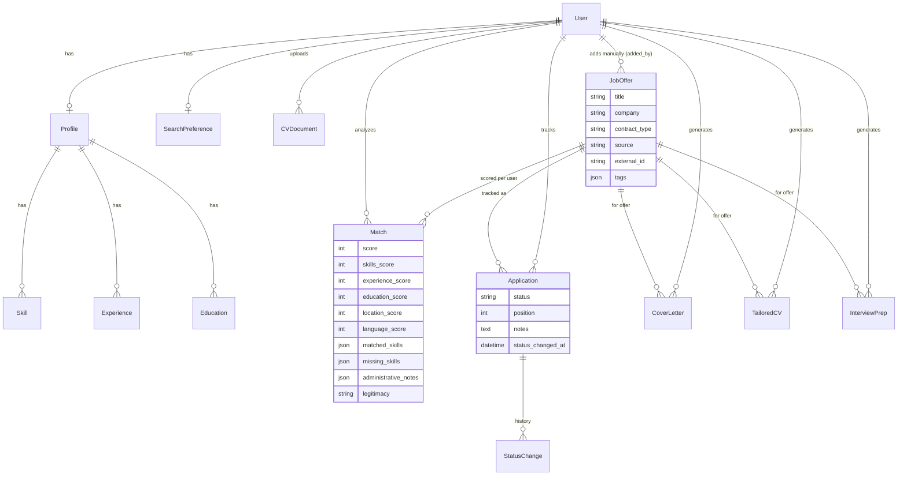

# Architecture

## App responsibilities

| App | Responsibility |
|---|---|
| `apps/accounts` | Custom `User` model (email as username, no username field), signup/login/logout. |
| `apps/core` | Landing page, dashboard (aggregate stats + charts), the shared LLM client (`llm.py`), dashboard aggregate queries (`services.py`), `/health/`. |
| `apps/profiles` | CV upload + AI parsing into a structured `Profile` (skills, experience, education), and `SearchPreference` (contract types, countries, desired start date — used both to filter the job list and to inform the AI matching prompt). |
| `apps/jobs` | `JobOffer` model, one importer per source (`apps/jobs/importers/`) behind a common `fetch(limit, **kwargs) -> list[dict]` interface, the manual paste-and-extract flow, search/filtering, and the "Postuler" action. |
| `apps/matching` | `Match`: the 5-axis compatibility score, legitimacy check, and administrative-eligibility notes for one (user, offer) pair. One LLM call per analysis; a no-AI keyword overlap pass grounds the prompt first. |
| `apps/letters` | Cover letter / tailored CV / interview prep generation (one LLM call each, from the same profile+offer context) and their PDF export. |
| `apps/applications` | The Kanban board: `Application` (status, position, notes) and `StatusChange` history, drag-and-drop persistence. |

Business logic lives in each app's `services.py`; views stay thin (fetch, call a service, render).
All LLM calls go through `apps/core/llm.py`, which is the only place that knows about the
OpenAI-compatible client, retries a malformed JSON response once, and raises `LLMError` with a
message safe to show a user.

## Request flow: analyzing one offer

This is the path from clicking "Analyser cette offre" on an offer detail page to the score
appearing, without a full page reload:

Reanalysis reuses the exact same endpoint — `update_or_create` means the row is replaced, never
duplicated, and the cached `Match` is shown on every subsequent page load with no further AI call
until the user explicitly asks to reanalyze.

## Data model

Notes on a few deliberate choices:

- **`Match` is unique per `(user, job_offer)`** — reanalyzing updates the row instead of growing
  a history, since only the latest compatibility score is ever meaningful.
- **`CoverLetter`, `TailoredCV`, `InterviewPrep` are *not* unique per offer** — every "Régénérer"
  click creates a new row, ordered newest-first, so past versions aren't lost.
- **`Application` carries its own `position`** (drag-and-drop order within a Kanban column) and
  `status_changed_at`, updated only on an actual status change — `StatusChange` rows are the
  append-only audit log used for the "candidatures par statut" dashboard stats.
